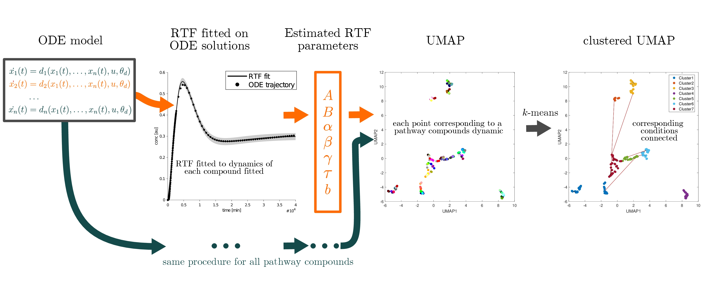

# ODE2UMAP
In this approach the (dose-dependent) retarded transient function (RTF) and UMAPs are used as a tool for dimensionality reduction of dynamics in ODE.

### RTF
The [dose-dependent RTF approach](https://academic.oup.com/bioinformatics/article/40/12/btae683/7903280) is an alternative to ODE modeling for signaling pathways. It produces intuitively interpretable parameters that describe signal dynamics and enables predictive modeling of time- and dose-dependencies, even if only individual cellular components are quantified. Moreover, it provides an intuitive way to characterize signaling differences between biological conditions or cell types. See [Examples/DoseDependentRTF](https://github.com/Data2Dynamics/d2d/tree/master/arFramework3/Examples/DoseDependentRTF) for d2d implementation.

### ODE &#8594; RTF &#8594; UMAP
ODE models can be complex and large with regard to their compounds. It can be difficult to analyse, interpret and understand the dynamics of all the compounds of an ODE model, especially when multiple biological conditions are considered. Here, we propose a procedure that combines the RTF approach with the  [uniform manifold approximation and projection (UMAP)](https://umap-learn.readthedocs.io/en/latest/) to perform dimensionality reduction based on reasonable dynamic quantities for characterising the dynamic response of the model components. 

By using the RTF parameters as an input for UMAP, clusters of the ODE compounds are generated according to the shapes of their dynamics. These low-dimensional representations can be used to evaluate how a compound is affected by external stimulation or how different biological conditions affect the dynamics. The method can be conducted for single dose data as well as for multiple doses using the dose-dependent RTF.

The method is applied to a published model of the NFκB signalling pathway from [Almaden et al.](https://doi.org/10.1016/j.celrep.2014.11.024) for illustration. 

**Addional Software needed:**

For the creation of the UMAPs you need the  [Matlab implementation of the UMAP Algorithm](https://www.mathworks.com/matlabcentral/fileexchange/71902).

**Cite:**
* [A New Approximation Approach for Transient Differential Equation Models](https://www.frontiersin.org/journals/physics/articles/10.3389/fphy.2020.00070) - Kreutz C. *Front. Phys.*, 8, 70, 2020.
* [Dynamic modelling of signalling pathways when ordinary differential equations are not feasible](https://academic.oup.com/bioinformatics/article/40/12/btae683/7903280) - Rachel T., et al. *Bioinformatics*, 40, 12, 2024.
* [The Dose-Dependent Retarded Transient Function: A Novel Approach for Modelling Cellular Signalling Dynamics](https://doi.org/10.6094/UNIFR/263264) - Rachel T., Master’s Thesis, 2024.
* [A Pathway Switch Directs BAFF Signaling to Distinct NFκB Transcription Factors in Maturing and Proliferating B Cells](https://doi.org/10.1016/j.celrep.2014.11.024) - Almaden J., Tsui R., Liu Y. et. al. *Cell Reports*, 9, 2014.
* [UMAP : Uniform Manifold Approximation and Projection for Dimension Reduction](https://doi.org/10.48550/arXiv.1802.03426)- McInnes L., Healy J. and Melville J., 2020
* [Uniform Manifold Approximation and Projection (UMAP)](https://www.mathworks.com/matlabcentral/fileexchange/71902) - Meehan C., Ebrahimian J., Moore W., and Meehan S., *MATLAB Central File Exchange*, 2022.

